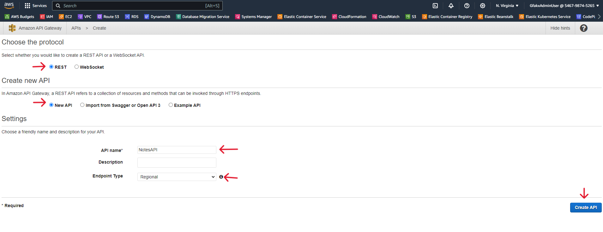
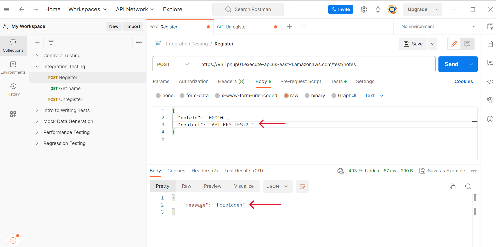

# Building a Serverless REST API with AWS Lambda, API Gateway, Python and DynamoDB

## Overview
This guide walks you through the process of constructing a serverless REST API using Python. This API encompasses the CRUD (Create, Read, Update, Delete) operations for a Notes application. The architecture is built upon AWS services, with AWS Lambda for serverless computing, DynamoDB as the NoSQL database, and API Gateway to expose our API endpoints. Python plays a pivotal role, acting as the backbone for our Lambda functions and data handling. We'll also integrate API keys to manage and restrict access to our API, ensuring differentiated access levels based on user plans.

## Prerequisites
Before diving in, ensure you have:
- An active AWS account.
- AWS CLI installed and configured.
- Basic knowledge of Python.
- An IDE or code editor of your choice.

## Step 1: Setting Up Your Environment
### AWS CLI & Python Environment
1. Install and configure the AWS CLI.
2. Verify your Python version and set up a virtual environment.
3. Inside this environment, install Boto3, the AWS SDK for Python.
```
python3 --version
python3 -m venv myenv
source myenv/bin/activate
pip install boto3
```


## Step 2: Designing the Data Model
### Notes Application Model
We'll define an entity named `Note` which encompasses the following properties:
- `noteId`: A unique identifier for the note.
- `title`: The note's title.
- `content`: The note's actual content.
- `timestamp`: The creation or last update time of the note.

## Step 3: Setting Up DynamoDB
### Table Creation
1. Navigate to DynamoDB through the AWS Management Console.
   - In the AWS Management Console, click on "Services" at the top left.
   - Under the "Database" section, select "DynamoDB".
2. Create a new table named "Notes" and set `noteId` as the primary key.
   - On DynamoDB dashboard, click on the "Create table" button
   - In the "Create DynamoDB table" screen:
   - For "Table name", enter "Notes".
   - For "Primary key", set:
   - Partition key: `noteId` of type "String".
   - Leave other settings to their defaults.
   - Click on the "Create" button at the bottom right.
 
 
 
## Step 4: Creating AWS Lambda Functions
### Development & Deployment
1. We are using Python as the programming language and employ the Boto3 library.
2. Create Lambda functions covering all CRUD operations on AWS.
   - On AWS Management Console and navigate to Lambda service.
   - Click on "Create function".
   - Name: Enter a name like NotesHandler.
   - Runtime: Choose Python 3.x.
   - Role: Choose an existing role or create a new one. This role should have permissions to interact with DynamoDB and CloudWatch logs.
 
3. Package these functions and upload them to AWS.
    - Create a Lambda Function file using Python
    - zip file `zip lambda_function.py`


4. Associate functions in AWS Lambda with roles that give them DynamoDB access permissions and Cloudwatch access .
   - Create IAM Role in AWS and assign these policy `AmazonDynamoDBFullAccess` & `CloudWatchFullAccess`


## Step 5: Initializing API Gateway
### API Creation & Integration
1. Create a new REST API within API Gateway.
   - Open the AWS Console and navigate to API Gateway.
   - Click on the "Create API" button.
   - You'll be presented with multiple options; choose "REST API".
   - Click on the "Build" button under the "REST API" option.
   - In the API Gateway dashboard for your newly created API, click on the "Create Resource" option from the "Actions" dropdown menu.
   - Name the resource "notes" and set the Resource Path to /notes.
   - Click "Create Resource".



2. Define resources (`/notes` and `/notes/{id}`) and their associated CRUD methods.
   - With the /notes resource selected, click on the "Create Method" dropdown and select GET. This will be for listing notes.
   - Repeat the process for `POST`, `DELETE`, and `PUT` which will be for creating a note.

3. Connect each method to its corresponding Lambda function.
   - Click on the method (e.g., GET under /notes).
   - In the setup pane, choose "Lambda Function" for the integration type.
   - Check the "Use Lambda Proxy integration" box.
   - Select the region where your Lambda function resides.
   - Type the name of the corresponding Lambda function (e.g., "InsertNoteFunction" for the POST method under /notes).
     Click on the "Save" button.
   - You'll be prompted to give API Gateway permission to invoke the Lambda function; confirm this.
4. Enable CORS to accommodate cross-origin requests.
   - Select the /notes resource.
   - From the "Actions" menu, choose "Enable CORS".
   - Click on the "Enable CORS and replace existing CORS headers" button.
   - Confirm by clicking "Yes, replace existing values".
5. After finalizing configurations, deploy the API and note down the provided Invoke URL.
   - From the "Actions" menu, select "Deploy API".
   - Choose a deployment stage or create a new one (e.g., "prod" for production or "test" for testing).
   - Note down the "Invoke URL"; this is the endpoint you'll use to interact with your API.

## Step 6: API Testing
### Verification & Troubleshooting
1. Use Postman  send requests to the API.
   - Launch the Postman application on your computer.
   - In the top bar, you'll see a dropdown where you can select the HTTP method (GET, POST, PUT, DELETE). For the start, let's go with a GET method to list all the notes.
   - Paste the Invoke URL you retrieved from the AWS API Gateway into the URL bar in Postman. For listing all notes, append /notes to the end of the URL. It should look something like this: `https://your-api-id.execute-api.your-region.amazonaws.com/your-stage/notes`
  
 
 
2. Validate each CRUD operation for correct functionality.
3. Address any concerns, focusing on data type handling and refining error messages for clarity.
 
## Step 7: Implementing Authentication With API Keys
### API Key Creation & Management
1. Generate an API key within API Gateway.
   - In the API Gateway console, choose the name of the API you want to create an API key for.
   - In the navigation pane, choose API Keys.
   - Choose Create API key.
   - (Optional) In the Name input box, type a name for the API key.
   - Choose Save.
2. Establish usage plans, such as a standard-plan (100 requests/minute) or a premium-plan (500 requests/minute).
   - In the API Gateway console, navigate to Usage Plans and click Create.
   - Define the name of the plan, e.g., standard-plan.
   - Set a throttle and/or quota limits as per your requirements. For example, you can set 100 requests per minute for the standard-plan.
   - Save the plan.
   - Repeat the above steps to create a premium-plan with higher limits, e.g., 500 requests per minute.
 
3. Link the API key to these plans and associate them with particular stages of your API.
   - Go to the created usage plan (either standard-plan or premium-plan).
   - Under the API Keys tab, click Add API Key to Usage Plan.
   - Select the API key you created and associate it with the plan.
 
4. Set up API key requirements for specific routes.
   - In the Usage Plan details page, navigate to the Associated API Stages tab.
   - Click Add API Stage.
   - Choose your API and its deployment stage.
   - Repeat this for both standard-plan and premium-plan if you have multiple stages or APIs.
 

 
 

## Step 8: Monitoring Using CloudWatch
### Logging & Performance Metrics
1. Access CloudWatch to oversee Lambda functions and the API Gateway's activity.
2. Explore logs for flow understanding and error identification.
3. Study metrics to gain insights into performance and identify any potential bottlenecks.
 
 
## Step 9: Cleanup
### Resource Deletion (Optional)
To circumvent unwanted AWS charges:
1. Delete all the AWS resources formed during this guide. This includes the API, Lambda functions, DynamoDB table, roles, policies, and more.

## Conclusion
By following this guide, you'll grasp the intricacies of building a serverless REST API with AWS. Combining AWS Lambda, DynamoDB, API Gateway, and API key authentication, you're on your way to crafting a robust and scalable Notes application. With varying access levels managed via API keys, this setup serves as a comprehensive blueprint for those venturing into the world of serverless applications, with a focus on best practices, efficient troubleshooting, and scalability.

- Checked each CRUD operation to ensure they functioned correctly.
- Addressed issues such as data type handling and enhanced error messaging for clarity.

## 7. Authentication With API Keys
### API Key Creation & Management
- Generated an API key within API Gateway.
- Created usage plans like standard-plan (e.g., 100 requests/minute) and premium-plan (e.g., 500 requests/minute).
- Associated the API key with these plans and further linked plans to specific stages of our API.
- Enabled API key requirements for specific routes.
- Shared API keys with clients based on their subscription plan.

## 8. Monitoring with CloudWatch
### Logging & Metrics
- Accessed CloudWatch to monitor both Lambda functions and the API Gateway.
- Viewed logs to understand the flow and any errors.
- Additionally, metrics provided insights into performance and potential bottlenecks.

## 9. Cleanup
### Resource Deletion
- To avoid unnecessary AWS charges, deleted all AWS resources created during this project. This includes the API, Lambda functions, DynamoDB table, roles, policies, and more.

## Conclusion
This documentation provides a step-by-step guide on creating a serverless REST API with AWS. With the integration of AWS Lambda, DynamoDB, API Gateway, and authentication using API keys, we built a robust and scalable Notes application. The system is designed to be efficient with different access levels managed via API keys. This serves as an excellent blueprint for anyone seeking to delve into serverless applications, emphasizing best practices, debugging, and scalability.
